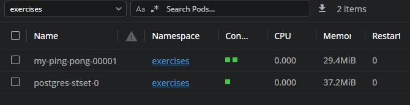
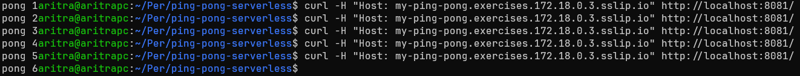
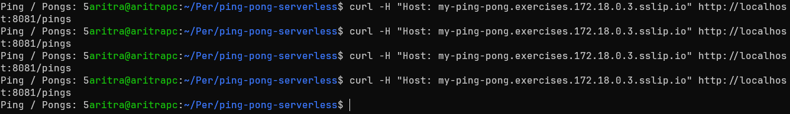
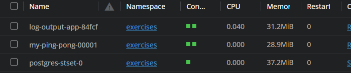
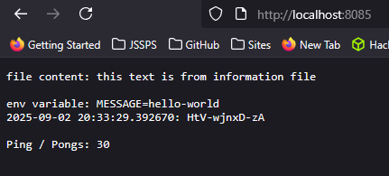

# Making Ping-Pong serverless - Knative

This is the answer to exercise `5.7`.

## Cluster Setup

Cluster was created with Traefik disabled with the below command

```shell
k3d cluster create --port 8082:30080@agent:0 -p 8081:80@loadbalancer --agents 2 --k3s-arg "--disable=traefik@server:0"
```

Next the Knative Serving was installed on the cluster from [the Knative docs](https://knative.dev/docs/install/yaml-install/serving/install-serving-with-yaml/).

> For convenience I created the [`clusterinit.sh`](./clusterinit.sh) bash file which when executed, does all the steps in the Docs which has the following configs
> - Kourier for Networking Ingress
> - Magic DNS (sslip.io) in the Configuring DNS stage.

## Changes to `ping-pong` Application

Changed Deployment and Service to Knative Service and applied all required with `kubectl apply -f ping-pong/manifests`



And checked that a request to the `/` and `/pings` directory actually yielded results with the command

```shell
curl -H "Host: my-ping-pong.exercises.172.18.0.3.sslip.io" http://localhost:8081/
```

The result was as expected and the pongs counter increased with each request.



> The pongs count is on the left side because it is printing the raw string `b'pong x'` and without a newline character like `b'pong x\n'`. Same thing for the total pongs count on path `/pings` as seem in the below image.



## Changes to `log-output` Application

Changed Deployment and Service to Knative Service and applied all required with 

```shell
kubectl apply -f ping-pong/volumes/ && kubectl apply -f log-output/manifests/
```

This successfully deployed the `log-output` application to the cluster.




## Final Results

Results after `kubectl port-forward log-output-app-xxx 8085`. This mapped port `8080` (listening port for both applications) with port `8085` on localhost.


